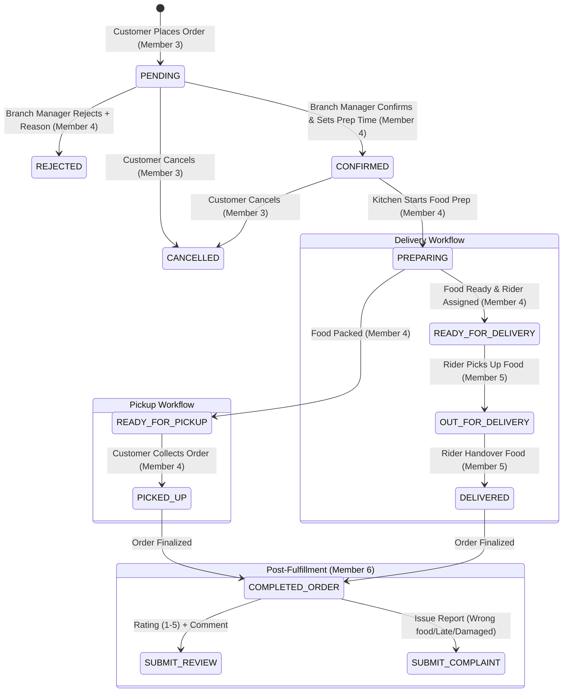

# Spice Avenue – Comprehensive Project Master Guide & Architecture
**Coursework**: SE2030 – Software Engineering (SLIIT Year 2 Semester 1)  
**Project Name**: Spice Avenue – Multi-Branch Web-Based Food Ordering & Management Platform  

---

## 1. System Architecture & High-Level Design

Spice Avenue is designed as a decoupled enterprise application with a single centralized database, a stateless RESTful Spring Boot backend, and a modern Single-Page Application (SPA) frontend in React.

```
┌─────────────────────────────────────────────────────────────────────────────┐
│                          React SPA Client (Vite)                            │
│  ┌───────────────┐ ┌───────────────┐ ┌───────────────┐ ┌────────────────┐   │
│  │ Customer      │ │ Branch Manager│ │ Delivery Rider│ │ Supervisor /   │   │
│  │ Portal (M3,M6)│ │ Portal (M2,M4)│ │ Portal (M5)   │ │ Ops Manager(M1)│   │
│  └───────┬───────┘ └───────┬───────┘ └───────┬───────┘ └────────┬───────┘   │
└──────────┼─────────────────┼─────────────────┼──────────────────┼───────────┘
           │                 │                 │                  │
           └─────────────────┼─────────────────┴──────────────────┘
                             ▼ REST APIs (JSON + JWT Authorization Bearer Token)
┌─────────────────────────────────────────────────────────────────────────────┐
│                          Spring Boot 3 REST Backend                         │
│  ┌───────────────────────────────────────────────────────────────────────┐  │
│  │ Spring Security (JWT Filter, Role-Based Access Control, CORS Config)  │  │
│  └───────────────────────────────────┬───────────────────────────────────┘  │
│                                      ▼                                       │
│  ┌───────────────┬───────────────┬───────────────┬───────────────┬────────┐ │
│  │ Member 1:     │ Member 2:     │ Member 3:     │ Member 4:     │ M5 & M6│ │
│  │ Branch & Area │ Menu & Item   │ Customer Cart │ Order Prep    │ Rider &│ │
│  │ Management    │ Variations    │ & Checkout    │ & Fulfillment │ Feedback││
│  └───────┬───────┴───────┬───────┴───────┬───────┴───────┬───────┴────┬───┘ │
│          │               │               │               │            │     │
│          ▼               ▼               ▼               ▼            ▼     │
│  ┌───────────────────────────────────────────────────────────────────────┐  │
│  │ Spring Data JPA (Hibernate ORM Entities, Repositories, Transactions)  │  │
│  └───────────────────────────────────┬───────────────────────────────────┘  │
└──────────────────────────────────────┼──────────────────────────────────────┘
                                       ▼
┌─────────────────────────────────────────────────────────────────────────────┐
│                           MySQL 8.x Master Database                         │
│   [users] [branches] [delivery_areas] [categories] [menu_items]             │
│   [menu_variations] [customer_addresses] [orders] [order_items]            │
│   [deliveries] [complaints] [reviews]                                       │
└─────────────────────────────────────────────────────────────────────────────┘
```

---

## 2. Six Member Module Allocation & Boundaries

| Member | Module Name | Primary User | Core Responsibility |
| :--- | :--- | :--- | :--- |
| **Member 1** | **Branch Management** | Operations Manager, Branch Manager | Branch CRUD, Operating Hours, Delivery Areas (non-GPS), Branch Performance Metrics. |
| **Member 2** | **Menu Management** | Branch Manager | Food Categories CRUD, Menu Items CRUD, Item Variations (Sizes/Portions + Extra Prices), Stock Availability Toggle, Image Uploads. |
| **Member 3** | **Customer Ordering** | Customer | Order Type Selection (Pickup/Delivery), Address Book CRUD, Cart CRUD, Checkout, Order Placement, Customer Cancellation, Order Tracking. |
| **Member 4** | **Order Fulfillment** | Branch Manager | Incoming Orders Queue, Order Confirmation/Rejection (with mandatory reason), Prep Time Estimation, Kitchen Status Workflow (`PREPARING`, `READY_FOR_PICKUP`), Delivery Rider Assignment. |
| **Member 5** | **Delivery Management**| Delivery Rider | Rider Availability Toggle (`AVAILABLE`, `BUSY`, `OFFLINE`), Assigned Delivery Queue, Acceptance (Auto-Busy), Delivery Lifecycle (`OUT_FOR_DELIVERY` $\rightarrow$ `DELIVERED`), Delivery History. |
| **Member 6** | **Complaint & Review** | Customer, CS Supervisor | Post-delivery 1-5 Star Ratings & Reviews (CRUD), Order Complaints Submission (`PENDING` $\rightarrow$ `IN_PROGRESS` $\rightarrow$ `RESOLVED`), Supervisor Resolution Dashboard. |

---

## 3. Order & Status Lifecycle State Machine



---

## 4. Master Database ERD Table Specifications

### 4.1 `users`
* `user_id` (BIGINT, PK, AI)
* `full_name` (VARCHAR(100), NOT NULL)
* `email` (VARCHAR(100), UNIQUE, NOT NULL)
* `password` (VARCHAR(255), NOT NULL) - BCrypt Hashed
* `phone_number` (VARCHAR(20), UNIQUE, NOT NULL)
* `role` (ENUM: `'CUSTOMER'`, `'BRANCH_MANAGER'`, `'RIDER'`, `'SUPERVISOR'`, `'OPS_MANAGER'`, `'ADMIN'`)
* `rider_status` (ENUM: `'AVAILABLE'`, `'BUSY'`, `'OFFLINE'`, DEFAULT `'OFFLINE'`)
* `created_at` (TIMESTAMP)

### 4.2 `branches` (Member 1)
* `branch_id` (BIGINT, PK, AI)
* `branch_name` (VARCHAR(100), UNIQUE, NOT NULL)
* `street_address` (VARCHAR(255), NOT NULL)
* `contact_number` (VARCHAR(20), UNIQUE, NOT NULL)
* `email` (VARCHAR(100), UNIQUE, NOT NULL)
* `opening_time` (TIME, NOT NULL)
* `closing_time` (TIME, NOT NULL)
* `manager_id` (BIGINT, FK $\rightarrow$ `users.user_id`, UNIQUE, NULLABLE)
* `status` (ENUM: `'ACTIVE'`, `'INACTIVE'`, DEFAULT `'ACTIVE'`)

### 4.3 `delivery_areas` (Member 1)
* `area_id` (BIGINT, PK, AI)
* `branch_id` (BIGINT, FK $\rightarrow$ `branches.branch_id`, NOT NULL)
* `area_name` (VARCHAR(100), NOT NULL)
* `delivery_fee` (DECIMAL(10,2), DEFAULT 0.00)
* `status` (ENUM: `'ACTIVE'`, `'INACTIVE'`, DEFAULT `'ACTIVE'`)

### 4.4 `categories` (Member 2)
* `category_id` (BIGINT, PK, AI)
* `branch_id` (BIGINT, FK $\rightarrow$ `branches.branch_id`, NOT NULL)
* `category_name` (VARCHAR(100), NOT NULL)
* `description` (TEXT)
* `status` (ENUM: `'ACTIVE'`, `'INACTIVE'`, DEFAULT `'ACTIVE'`)

### 4.5 `menu_items` (Member 2)
* `item_id` (BIGINT, PK, AI)
* `branch_id` (BIGINT, FK $\rightarrow$ `branches.branch_id`, NOT NULL)
* `category_id` (BIGINT, FK $\rightarrow$ `categories.category_id`, NOT NULL)
* `food_name` (VARCHAR(150), NOT NULL)
* `description` (TEXT)
* `base_price` (DECIMAL(10,2), NOT NULL)
* `image_url` (VARCHAR(255))
* `is_available` (BOOLEAN, DEFAULT TRUE)
* `status` (ENUM: `'ACTIVE'`, `'INACTIVE'`, DEFAULT `'ACTIVE'`)

### 4.6 `menu_variations` (Member 2)
* `variation_id` (BIGINT, PK, AI)
* `item_id` (BIGINT, FK $\rightarrow$ `menu_items.item_id`, NOT NULL)
* `variation_name` (VARCHAR(100), NOT NULL) (e.g., "Regular", "Large", "500ml")
* `additional_price` (DECIMAL(10,2), NOT NULL, DEFAULT 0.00)
* `status` (ENUM: `'ACTIVE'`, `'INACTIVE'`, DEFAULT `'ACTIVE'`)

### 4.7 `customer_addresses` (Member 3)
* `address_id` (BIGINT, PK, AI)
* `customer_id` (BIGINT, FK $\rightarrow$ `users.user_id`, NOT NULL)
* `label` (VARCHAR(50)) (e.g., "Home", "Office")
* `house_number` (VARCHAR(50), NOT NULL)
* `street` (VARCHAR(255), NOT NULL)
* `area_id` (BIGINT, FK $\rightarrow$ `delivery_areas.area_id`, NOT NULL)
* `is_default` (BOOLEAN, DEFAULT FALSE)

### 4.8 `orders` (Member 3 & 4)
* `order_id` (BIGINT, PK, AI)
* `order_number` (VARCHAR(50), UNIQUE, NOT NULL) (e.g., "ORD-20260815-001")
* `customer_id` (BIGINT, FK $\rightarrow$ `users.user_id`, NOT NULL)
* `branch_id` (BIGINT, FK $\rightarrow$ `branches.branch_id`, NOT NULL)
* `order_type` (ENUM: `'PICKUP'`, `'DELIVERY'`, NOT NULL)
* `status` (ENUM: `'PENDING'`, `'CONFIRMED'`, `'PREPARING'`, `'READY_FOR_PICKUP'`, `'PICKED_UP'`, `'READY_FOR_DELIVERY'`, `'OUT_FOR_DELIVERY'`, `'DELIVERED'`, `'CANCELLED'`, `'REJECTED'`)
* `subtotal` (DECIMAL(10,2), NOT NULL)
* `delivery_fee` (DECIMAL(10,2), DEFAULT 0.00)
* `total_amount` (DECIMAL(10,2), NOT NULL)
* `payment_method` (ENUM: `'CARD'`, `'CASH_ON_DELIVERY'`)
* `delivery_address_id` (BIGINT, FK $\rightarrow$ `customer_addresses.address_id`, NULLABLE)
* `estimated_prep_minutes` (INT, NULLABLE)
* `rejection_reason` (VARCHAR(255), NULLABLE)
* `cancellation_reason` (VARCHAR(255), NULLABLE)
* `created_at` (TIMESTAMP)

### 4.9 `order_items` (Member 3)
* `order_item_id` (BIGINT, PK, AI)
* `order_id` (BIGINT, FK $\rightarrow$ `orders.order_id`, NOT NULL)
* `item_id` (BIGINT, FK $\rightarrow$ `menu_items.item_id`, NOT NULL)
* `variation_id` (BIGINT, FK $\rightarrow$ `menu_variations.variation_id`, NULLABLE)
* `quantity` (INT, NOT NULL)
* `unit_price` (DECIMAL(10,2), NOT NULL)
* `total_price` (DECIMAL(10,2), NOT NULL)

### 4.10 `deliveries` (Member 5)
* `delivery_id` (BIGINT, PK, AI)
* `order_id` (BIGINT, FK $\rightarrow$ `orders.order_id`, UNIQUE, NOT NULL)
* `rider_id` (BIGINT, FK $\rightarrow$ `users.user_id`, NOT NULL)
* `status` (ENUM: `'ASSIGNED'`, `'ACCEPTED'`, `'OUT_FOR_DELIVERY'`, `'DELIVERED'`)
* `assigned_at` (TIMESTAMP)
* `accepted_at` (TIMESTAMP, NULLABLE)
* `out_for_delivery_at` (TIMESTAMP, NULLABLE)
* `delivered_at` (TIMESTAMP, NULLABLE)

### 4.11 `complaints` (Member 6)
* `complaint_id` (BIGINT, PK, AI)
* `order_id` (BIGINT, FK $\rightarrow$ `orders.order_id`, NOT NULL)
* `customer_id` (BIGINT, FK $\rightarrow$ `users.user_id`, NOT NULL)
* `category` (VARCHAR(100), NOT NULL) (e.g., "Wrong Food", "Late Delivery", "Packaging Damaged")
* `description` (TEXT, NOT NULL)
* `image_url` (VARCHAR(255), NULLABLE)
* `status` (ENUM: `'PENDING'`, `'IN_PROGRESS'`, `'RESOLVED'`, DEFAULT `'PENDING'`)
* `resolution_notes` (TEXT, NULLABLE)
* `resolved_by` (BIGINT, FK $\rightarrow$ `users.user_id`, NULLABLE)
* `resolved_at` (TIMESTAMP, NULLABLE)
* `created_at` (TIMESTAMP)

### 4.12 `reviews` (Member 6)
* `review_id` (BIGINT, PK, AI)
* `order_id` (BIGINT, FK $\rightarrow$ `orders.order_id`, UNIQUE, NOT NULL)
* `customer_id` (BIGINT, FK $\rightarrow$ `users.user_id`, NOT NULL)
* `rating` (INT, NOT NULL) - 1 to 5 Stars
* `comment` (TEXT)
* `review_date` (TIMESTAMP)

---

## 5. Master REST API Catalog

### Shared & Auth Endpoints
* `POST /api/auth/register` – Register new customer
* `POST /api/auth/login` – Login & receive JWT token + user profile/role
* `GET /api/auth/profile` – Fetch current user profile

### Member 1: Branch Management
* `GET /api/branches` – List all branches
* `GET /api/branches/{id}` – Get branch details
* `POST /api/branches` – Create branch *(Ops Manager)*
* `PUT /api/branches/{id}` – Update branch info
* `PATCH /api/branches/{id}/status` – Activate/Deactivate branch
* `PATCH /api/branches/{id}/assign-manager` – Assign Branch Manager
* `POST /api/branches/{id}/delivery-areas` – Add supported delivery area
* `GET /api/branches/{id}/delivery-areas` – List delivery areas for branch
* `GET /api/branches/{id}/performance` – View operational metrics (Orders, Revenue, Ratings)

### Member 2: Menu Management
* `GET /api/branches/{branchId}/categories` – List branch food categories
* `POST /api/categories` – Create category
* `PUT /api/categories/{id}` – Update category
* `PATCH /api/categories/{id}/status` – Soft-delete category
* `GET /api/branches/{branchId}/menu-items` – List menu items
* `POST /api/menu-items` – Create menu item (with base price & category)
* `PUT /api/menu-items/{id}` – Edit menu item
* `PATCH /api/menu-items/{id}/availability` – Toggle In Stock / Out of Stock
* `POST /api/menu-items/{itemId}/variations` – Add variation (e.g. Large +$2.50)
* `DELETE /api/variations/{id}` – Delete variation

### Member 3: Customer Ordering
* `GET /api/customer/addresses` – View customer address book
* `POST /api/customer/addresses` – Add saved address
* `DELETE /api/customer/addresses/{id}` – Remove address
* `GET /api/customer/menu?branchId={id}` – Browse branch menu
* `POST /api/customer/orders` – Place order (Pickup or Delivery)
* `GET /api/customer/orders` – View order history
* `GET /api/customer/orders/{id}/track` – Live order progress tracking
* `PATCH /api/customer/orders/{id}/cancel` – Cancel order (Only if PENDING/CONFIRMED)

### Member 4: Order Fulfillment Management
* `GET /api/fulfillment/orders/incoming?branchId={id}` – Branch incoming order queue
* `PATCH /api/fulfillment/orders/{id}/confirm` – Confirm order + set prep minutes
* `PATCH /api/fulfillment/orders/{id}/reject` – Reject order + mandatory reason
* `PATCH /api/fulfillment/orders/{id}/preparing` – Mark preparation started
* `PATCH /api/fulfillment/orders/{id}/ready-pickup` – Mark ready for customer pickup
* `PATCH /api/fulfillment/orders/{id}/picked-up` – Mark picked up (completes pickup flow)
* `PATCH /api/fulfillment/orders/{id}/ready-delivery` – Mark ready for delivery
* `PATCH /api/fulfillment/orders/{id}/assign-rider` – Assign available delivery rider

### Member 5: Delivery Management
* `GET /api/delivery/riders/available?branchId={id}` – List available riders
* `PATCH /api/delivery/riders/my-status` – Rider sets `AVAILABLE`, `BUSY`, `OFFLINE`
* `GET /api/delivery/my-tasks` – Rider views assigned deliveries
* `PATCH /api/delivery/tasks/{deliveryId}/accept` – Rider accepts assignment (auto-busy)
* `PATCH /api/delivery/tasks/{deliveryId}/out-for-delivery` – Rider picks up package
* `PATCH /api/delivery/tasks/{deliveryId}/delivered` – Rider completes delivery (auto-available)
* `GET /api/delivery/my-history` – Rider views past completed deliveries

### Member 6: Complaint & Review Management
* `POST /api/customer/complaints` – Submit complaint for completed order
* `GET /api/customer/my-complaints` – Customer monitors complaint statuses
* `GET /api/supervisor/complaints` – Supervisor queues pending complaints
* `PATCH /api/supervisor/complaints/{id}/status` – Mark `IN_PROGRESS`
* `PATCH /api/supervisor/complaints/{id}/resolve` – Record solution notes & close complaint
* `POST /api/customer/reviews` – Submit 1-5 star review for completed order
* `PUT /api/customer/reviews/{id}` – Edit review
* `DELETE /api/customer/reviews/{id}` – Delete review
* `GET /api/supervisor/feedback-analytics` – Customer satisfaction dashboard & ratings

---

## 6. Viva Defense Quick Reference Guide

| Member | Common Question | Model Answer |
| :--- | :--- | :--- |
| **Member 1 vs Member 2** | *What is the boundary between Branch and Menu management?* | **Member 1** manages *where* the restaurant operates (branches, physical locations, operating hours, delivery coverage areas). **Member 2** manages *what food* each branch sells (categories, items, variation pricing, stock availability). |
| **Member 3 vs Member 4** | *What is the boundary between Customer Ordering and Fulfillment?* | **Member 3** handles the *external customer journey* (cart, branch selection, delivery address, order placement, cancellation). **Member 4** handles the *internal restaurant kitchen journey* (reviewing incoming orders, confirming prep time, advancing kitchen statuses, rider assignment). |
| **Member 4 vs Member 5** | *What is the boundary between Fulfillment and Delivery?* | **Member 4** answers *"What happens inside the restaurant kitchen?"* (Food prep, packing, rider assignment). **Member 5** answers *"What happens after the food leaves the restaurant?"* (Rider availability, pickup transit, delivery confirmation, handover). |
| **Member 5 vs Member 6** | *What is the boundary between Delivery and Complaint/Review?* | **Member 5** concludes when the physical food is handed over to the customer (`DELIVERED`). **Member 6** begins post-fulfillment to measure customer satisfaction, collect ratings, and resolve post-order service discrepancies. |
